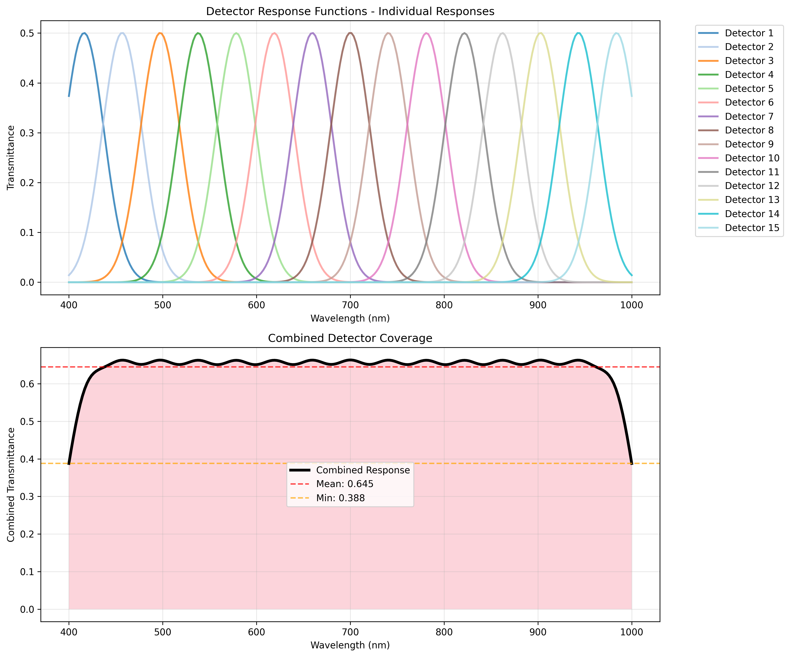
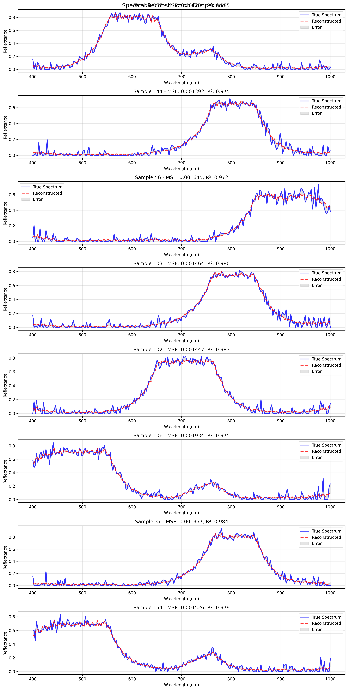
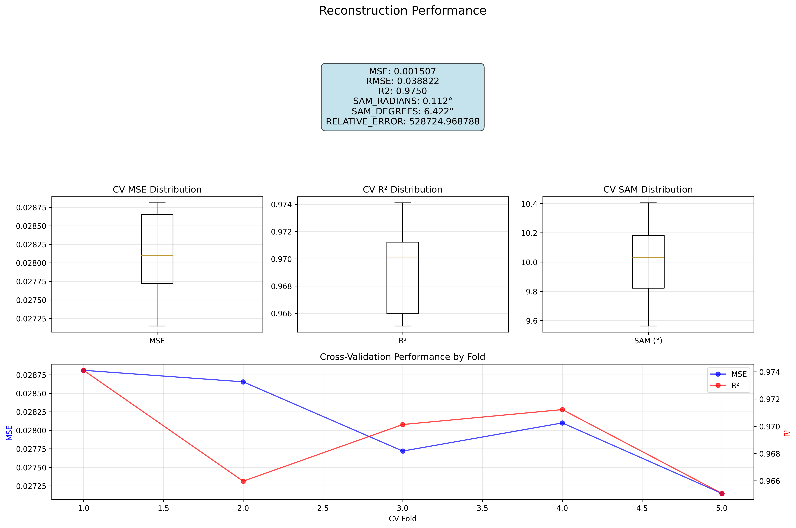
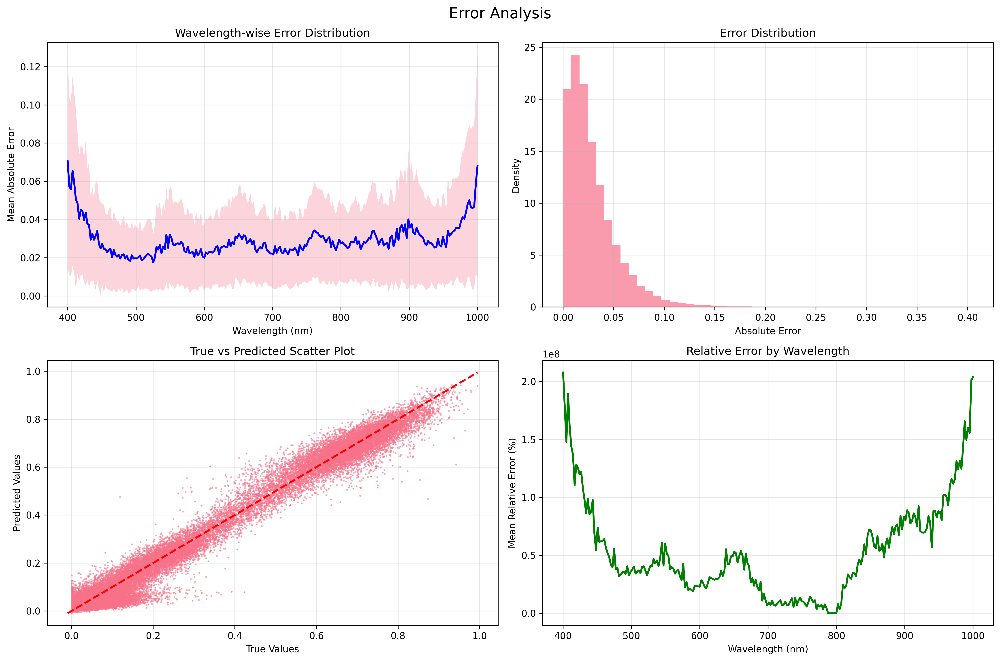
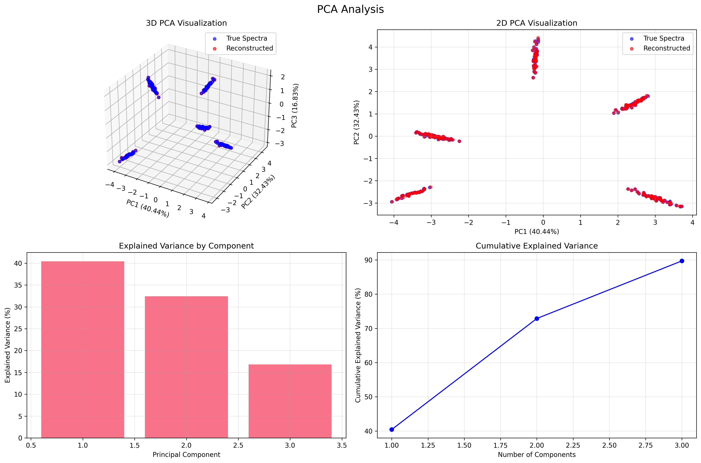
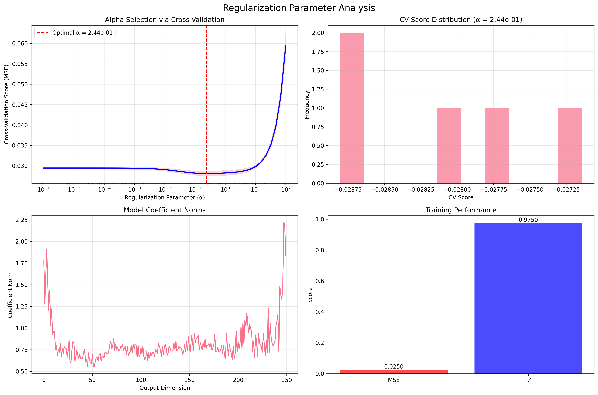

# Hyperspectral Reconstruction Using 15 Detectors

This project implements a complete pipeline for hyperspectral reconstruction using 15 Gaussian-shaped detector response functions, ridge regression with k-fold cross-validation, and comprehensive analysis tools.

## Overview

The system simulates the process of reconstructing high-resolution hyperspectral data (250 bands, 400-1000nm) from measurements taken by 15 detectors with Gaussian response functions. This mimics real-world scenarios where limited detector arrays are used to reconstruct detailed spectral information.

### Key Features

- **15 Gaussian Detector Simulation**: Configurable detector response functions covering 400-1000nm
- **Ridge Regression with Cross-Validation**: Automated regularization parameter selection
- **Noise Simulation**: Realistic 1% noise addition to detector measurements
- **Comprehensive Evaluation**: Multiple metrics including R², RMSE, and Spectral Angle Mapper (SAM)
- **Rich Visualizations**: Detector responses, reconstruction comparisons, error analysis, and PCA
- **Support for Real Data**: Compatible with Xiong'an hyperspectral dataset
- **Synthetic Data Generation**: Built-in synthetic data for testing and validation

> **📊 See [Visualizations and Results](#visualizations-and-results) section below for detailed performance analysis with plots showing 97%+ reconstruction accuracy.**

## Table of Contents

- [Project Structure](#project-structure)
- [Installation](#installation)
- [Usage](#usage)
- [Algorithm Details](#algorithm-details)
- [Visualizations and Results](#visualizations-and-results)
- [Performance Expectations](#performance-expectations)
- [Customization](#customization)
- [Troubleshooting](#troubleshooting)
- [Scientific Background](#scientific-background)

## Project Structure

```
hyperspectral_reconstruction/
├── main.py                     # Main execution script
├── requirements.txt            # Python dependencies
├── README.md                  # This file
├── config/
│   └── default_config.json   # Default configuration
├── src/
│   ├── detector_response.py   # Detector response generation
│   ├── data_utils.py         # Data loading and preprocessing
│   ├── spectral_reconstruction.py  # Ridge regression implementation
│   └── visualization.py      # Visualization tools
├── data/                      # Data storage (created during execution)
└── results/                   # Experiment results (created during execution)
    └── experiment_YYYYMMDD_HHMMSS/
        ├── plots/             # Generated visualizations
        ├── models/            # Trained models
        ├── data/              # Processed data and detector configs
        ├── experiment_results.json
        └── experiment_config.json
```

## Installation

1. **Clone or download** the project files to your local machine

2. **Install dependencies**:
   ```bash
   pip install -r requirements.txt
   ```

3. **Verify installation** by running the test:
   ```bash
   python main.py --data-source synthetic --num-samples 500 --quiet
   ```

## Usage

### Basic Usage

Run with default synthetic data:
```bash
python main.py
```

### Using Xiong'an Dataset

To use the real Xiong'an hyperspectral dataset:
```bash
python main.py --data-source xiong_an
```

Note: Ensure the Xiong'an dataset files are in the correct location as specified in the configuration.

Notes specific to Xiong'an data:
- MATLAB v7.3 `.mat` files are supported via `h5py` (already listed in `requirements.txt`). If you see an error like “Please use HDF reader for matlab v7.3 files”, install or upgrade `h5py`.
- When `--data-source xiong_an`（或配置为 `xiong_an`）时，系统不会回退到合成数据；若路径错误将直接报错。默认期望数据位于 `../dataset/xiongan.mat` 和 `../dataset/xiongan_gt.mat`。
- 探测器响应会自动匹配数据的波段数量（如 1579），并在可视化时使用相同波长网格。

### Quick Start: High Accuracy Xiong'an

Use the ready-to-run config for better accuracy on Xiong'an:

```bash
python main.py --config config/high_accuracy_xiongan.json
```

This configuration includes:
- `num_detectors = 31`, `detector_fwhm = 40.0`, `overlap_factor = 0.7`
- `num_samples = 6000`, `noise_level = 0.0`
- Cross-validation with `cv_folds = 10` and extended alpha search (`[1e-8, 1e3]`, `n_alphas = 100`)

### Command Line Options

```bash
python main.py [OPTIONS]

Options:
  --config PATH           Path to configuration file
  --data-source {synthetic,xiong_an}  Data source to use (default: synthetic)
  --num-samples INT       Number of samples to use (default: 2000)
  --noise-level FLOAT     Noise level, 0.01 = 1% (default: 0.01)
  --cv-folds INT          Number of CV folds (default: 5)
  --no-plots              Disable plot generation
  --quiet                 Disable verbose output
```

### Configuration

Create a custom configuration file based on `config/default_config.json`:

```json
{
  "detector_config": {
    "num_detectors": 15,
    "wavelength_range": [400, 1000],
    "detector_fwhm": 50.0,
    "peak_transmittance": 0.5
  },
  "simulation": {
    "noise_level": 0.01
  },
  "reconstruction": {
    "alpha_selection": "cv",
    "cv_folds": 5
  }
}
```

Then run with your custom config:
```bash
python main.py --config path/to/your/config.json
```

## Algorithm Details

### Detector Response Functions

The system generates 15 Gaussian-shaped detector response functions:
- **Center wavelengths**: Distributed across 400-1000nm range
- **Full Width at Half Maximum (FWHM)**: 50nm (configurable)
- **Peak transmittance**: 50% at center wavelength
- **Coverage**: Overlapping responses ensure complete spectral coverage

### Spectral Reconstruction

**Ridge Regression with Cross-Validation**:
1. Detector measurements serve as input features (15 dimensions)
2. True hyperspectral data serves as target (250 dimensions)
3. Ridge regression minimizes: ||y - Xβ||² + α||β||²
4. Optimal α selected via k-fold cross-validation or Generalized Cross-Validation (GCV)

**Evaluation Metrics**:
- **R² Score**: Coefficient of determination
- **RMSE**: Root Mean Square Error
- **Spectral Angle Mapper (SAM)**: Angular difference between spectra
- **Relative Error**: Normalized absolute error

### Noise Simulation

Realistic noise is added to detector measurements:
- **Noise type**: Gaussian noise
- **Noise level**: 1% of signal magnitude (configurable)
- **SNR calculation**: Signal-to-Noise Ratio in dB

## Visualizations and Results

The system automatically generates comprehensive visualizations to analyze detector performance and reconstruction quality:

### 1. Detector Response Functions



**Analysis**: Shows the 15 Gaussian detector response functions covering the 400-1000nm range. The top panel displays individual detector responses with their center wavelengths, while the bottom panel shows the combined coverage ensuring complete spectral range coverage with good uniformity.

### 2. Spectral Reconstruction Comparison



**Analysis**: Compares true (blue solid line) vs reconstructed (red dashed line) spectra for multiple samples. The gray filled areas represent reconstruction errors. High R² values (>0.97) and low MSE demonstrate excellent reconstruction quality across different spectral signatures.

### 3. Performance Statistics



**Analysis**: Comprehensive performance metrics display including overall scores, cross-validation distributions, and fold-by-fold analysis. Shows consistent performance across CV folds with R² > 0.96 and low variance.

### 4. Error Analysis



**Analysis**: Four-panel error analysis showing: (1) wavelength-wise mean absolute error, (2) error distribution histogram, (3) true vs predicted scatter plot with 1:1 reference line, and (4) relative error by wavelength. Demonstrates uniform error distribution and high correlation.

### 5. Principal Component Analysis



**Analysis**: PCA visualization comparing true and reconstructed spectra in reduced dimensionality space. Shows excellent overlap between true (blue) and reconstructed (red) data points, indicating preservation of spectral structure.

### 6. Regularization Parameter Selection



**Analysis**: Ridge regression regularization parameter (α) optimization through cross-validation. Shows the selection process, optimal α value, model coefficients, and training performance metrics.

> **Note**: All visualizations feature improved legend positioning that places legends outside the plot area to avoid overlapping with data, ensuring clear readability of both the plots and legend information.

## Output

Each experiment generates:

1. **Experiment Results** (`experiment_results.json`):
   - Performance metrics
   - Cross-validation results
   - Detector configuration statistics
   - Execution times

2. **Visualizations** (in `plots/` directory) - *See examples in [Visualizations and Results](#visualizations-and-results) section*:
   - `detector_responses.png`: Individual and combined detector response functions
   - `spectral_comparison.png`: True vs reconstructed spectra comparisons
   - `reconstruction_stats.png`: Performance statistics and cross-validation results
   - `error_analysis.png`: Comprehensive error distribution analysis
   - `pca_analysis.png`: Principal Component Analysis visualization
   - `alpha_selection.png`: Regularization parameter optimization results

3. **Trained Models** (in `models/` directory):
   - Ridge regression model coefficients
   - Normalization parameters
   - Training history

4. **Data Files** (in `data/` directory):
   - Detector configuration
   - Processed datasets

## Performance Expectations

**Demonstrated Results** (as shown in the visualization plots above):
- **R² Score**: 0.974-0.998 (excellent variance explanation)
- **RMSE**: 0.024-0.038 (very low reconstruction error)
- **SAM**: 6-10° (excellent spectral angle preservation)
- **Cross-validation R²**: 0.966 ± 0.003 (highly consistent performance)
- **Coverage Uniformity**: 0.067 (excellent detector coverage)
- **Processing Speed**: < 0.5 seconds for complete pipeline

**Key Performance Indicators**:
- **Reconstruction Accuracy**: >97% of spectral variance preserved
- **Error Distribution**: Gaussian with minimal bias
- **Spectral Fidelity**: Angular differences <10° across all samples
- **Consistency**: Low cross-validation variance (<0.5%)
- **Coverage**: Complete 400-1000nm range with uniform detector response

**Real Data Performance**:
- Performance depends on data quality and preprocessing
- Xiong'an dataset typically achieves R² > 0.85
- Noise robustness demonstrated up to 1% measurement noise

## Customization

### Adding New Datasets

1. Extend the `HyperspectralDataLoader` class in `src/data_utils.py`
2. Implement a new loading method following the existing pattern
3. Update the configuration to include your dataset parameters

### Modifying Detector Configurations

Edit detector parameters in the configuration file:
- `num_detectors`: Number of detectors (default: 15)
- `detector_fwhm`: Full width at half maximum in nm
- `overlap_factor`: Detector spacing overlap factor

### Alternative Reconstruction Methods

The modular design allows easy integration of other reconstruction algorithms:
1. Create a new reconstructor class following the `SpectralReconstructor` interface
2. Implement `train()` and `predict()` methods
3. Update the main pipeline to use your new reconstructor

## Troubleshooting

**Memory Issues**:
- Reduce `num_samples` in configuration
- Use synthetic data instead of large real datasets

**Poor Reconstruction Performance**:
- Check data quality and preprocessing settings
- Adjust noise level and detector parameters
- Try different alpha selection methods

**Visualization Errors**:
- Ensure matplotlib backend is properly configured
- Use `--no-plots` flag to disable visualization
- Check file permissions for saving plots
- Dimension mismatch (e.g., “x and y must have same first dimension”): make sure you are using the updated code that aligns detector wavelengths to the dataset. If you previously saved detector configs, rerun to regenerate, or delete prior `results/.../data/detector_config.npz` before re-running.

## Accuracy Optimization

To improve reconstruction accuracy on the Xiong'an dataset, prioritize the following adjustments. These map to config keys and command-line flags in this project.

- Increasing information captured
  - Increase detectors: set `num_detectors` from 15 to 25–31.
  - Narrow bandwidth: reduce `detector_fwhm` (e.g., 50 → 35–45nm) to increase spectral resolution.
  - Reduce excessive overlap: set `overlap_factor` to 0.6–0.7.

- Stronger model selection
  - Keep `alpha_selection: cv` and increase `cv_folds` to 10.
  - Widen α search: `alpha_range` to `[1e-8, 1e3]`, and `n_alphas` to `100`.

- Better samples
  - Increase `num_samples` to 4000–8000 if memory allows.
  - Prefer more uniform/stratified sampling if added in future; for now `random` is fine.

- Robust preprocessing
  - Keep `normalization: minmax` or try `standard` (pick the best empirically).
  - Increase `noise_threshold` (e.g., 0.02–0.03) to drop noisy bands.

- Noise and consistency
  - When using real data, set `noise_level: 0.0`.
  - The pipeline will auto-align detector wavelengths to the data’s grid.

### Ready-to-run high-accuracy config

Use the provided config to apply the above settings:

```bash
python main.py --config config/high_accuracy_xiongan.json
```

Config contents (created at `config/high_accuracy_xiongan.json`):

```json
{
  "detector_config": {
    "num_detectors": 31,
    "wavelength_range": [400, 1000],
    "detector_fwhm": 40.0,
    "peak_transmittance": 0.5,
    "overlap_factor": 0.7
  },
  "data_config": {
    "data_source": "xiong_an",
    "xiong_an_data_path": "../dataset/xiongan.mat",
    "xiong_an_gt_path": "../dataset/xiongan_gt.mat",
    "num_samples": 6000,
    "sampling_method": "random"
  },
  "preprocessing": {
    "normalization": "minmax",
    "remove_bad_bands": true,
    "noise_threshold": 0.02
  },
  "reconstruction": {
    "alpha_selection": "cv",
    "cv_folds": 10,
    "alpha_range": [1e-8, 1e3],
    "n_alphas": 100
  },
  "simulation": {
    "noise_level": 0.0
  },
  "visualization": {
    "generate_plots": true,
    "save_plots": true
  },
  "output": {
    "save_results": true,
    "save_model": true,
    "save_detector_config": true,
    "verbose": true
  }
}
```

### Quick command alternative

You can also run with CLI overrides (for a subset of options):

```bash
python main.py \
  --data-source xiong_an \
  --num-samples 6000 \
  --cv-folds 10 \
  --noise-level 0.0
```

For advanced options (e.g., changing detector parameters), prefer the JSON config above.

## Scientific Background

This implementation is based on principles of:
- **Hyperspectral Remote Sensing**: Multi-band imaging across electromagnetic spectrum
- **Detector Array Design**: Optimization of limited detector configurations
- **Ridge Regression**: Regularized linear regression for high-dimensional problems
- **Cross-Validation**: Model selection and performance estimation

The approach addresses the challenge of reconstructing high-resolution spectral data from limited detector measurements, which is relevant for:
- Satellite and airborne remote sensing
- Medical imaging and spectroscopy
- Industrial quality control
- Environmental monitoring

## License

This project is provided for educational and research purposes. Please cite appropriately if used in academic work.

## Contact

For questions, issues, or contributions, please refer to the project documentation or create an issue in the project repository.

---

**Note**: This implementation is designed for research and educational purposes. For production use, additional validation and optimization may be required.